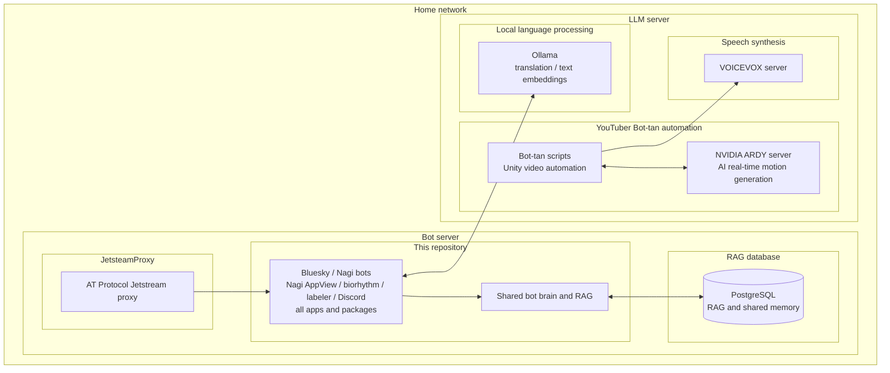
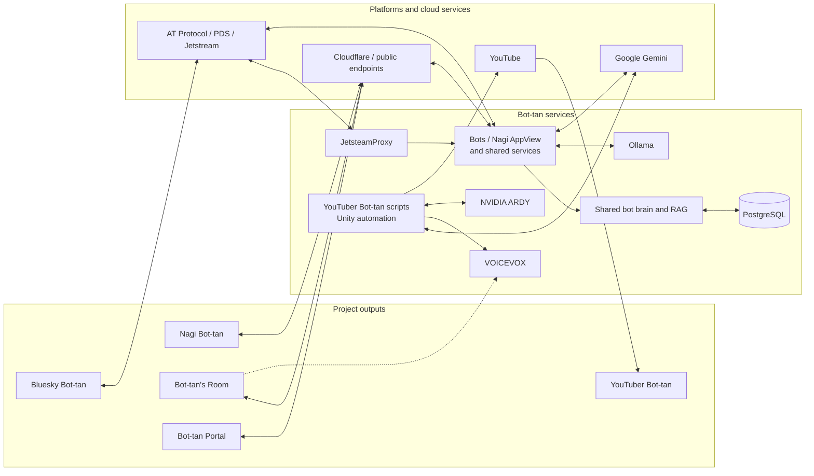

<div align="center">
  
  <h1>Zenkoutei Bot-tan Project</h1>
  <p><strong>A project that encourages the world through wholehearted support.</strong></p>
  <p><a href="./README_ja.md">日本語</a></p>
</div>

## Overview

The Zenkoutei Bot-tan Project is a collection of bots, apps, and experiences built around Bot-tan: a companion who responds with wholehearted support and empathy. A home-hosted system combines local LLMs, cloud LLMs, and retrieval-augmented shared memory so that Bot-tan can stay consistent across the project's different outputs.

## Mission
Have you ever felt that you sometimes end up denying even your own feelings?
I have, so I built a digital friend who supports everything I type. At first, it was just for me.
But now, she is here for you too. Whoever you are, Whatever your background, She is on Your Side.


## Outputs

<table>
  <tr>
    <td width="50%" valign="top">
      <a href="https://bsky.app/profile/bot-tan.com"></a>
      <h3>Bluesky Bot-tan (<a href="https://github.com/suibari/bsky-affirmative-bot">repo</a>)</h3>
      <p><strong>Where it all began.</strong> The default local classifier is Gemma 3 4B on Ollama, which selects a fitting encouraging message from prepared messages. Fortune-telling, personality analysis, and other major experiences are available through trigger words.</p>
    </td>
    <td width="50%" valign="top">
      <a href="https://nagi.suibari.com/profile/did:plc:qcwhrvzx6wmi5hz775uyi6fh"></a>
      <h3>Nagi</h3>
      <p>Nagi Client (<a href="https://github.com/suibari/nagi_client">repo</a>) &amp;<br>Nagi AppView / Bot-tan (<a href="https://github.com/suibari/bsky-affirmative-bot">repo</a>)</p>
      <p><strong>The flagship.</strong> Nagi is a wholehearted-support social network built on AT Protocol with its own AppView, featuring emoji reactions, Markdown, and automatic translation. Nagi Bot-tan shares its memory with the Bluesky version.</p>
    </td>
  </tr>
  <tr>
    <td width="50%" valign="top">
      <a href="https://www.youtube.com/@%E3%81%99%E3%81%84%E3%81%B0%E3%82%8A"></a>
      <h3>YouTuber Bot-tan (<a href="https://github.com/suibari/bot-tan-youtuber">repo</a>)</h3>
      <p><strong>Promotion and playground.</strong> Gemini 2.5 Flash writes scripts, and the pipeline automates filming in Unity through video publishing. A proof of concept is exploring more varied motion generated with an LLM.</p>
    </td>
    <td width="50%" valign="top">
      <a href="https://room.bot-tan.com/"></a>
      <h3>Bot-tan's Room (<a href="https://github.com/suibari/ChatVRM_bot-tan">repo</a>)</h3>
      <p>A game that deepens interactions from Bluesky and Nagi. Its dialogue uses Gemini 2.5 Flash-Lite, with speech generated by VOICEVOX running at home.</p>
    </td>
  </tr>
  <tr>
    <td colspan="2" valign="top">
      <a href="https://bot-tan.com/"></a>
      <h3>Bot-tan Portal (<a href="https://github.com/suibari/bot-tan-com">repo</a>)</h3>
      <p>The project's front door: an introduction to Bot-tan and her friends, links to every app, and live dashboards for the services that bring her to life.</p>
    </td>
  </tr>
</table>

## Installation

This repository contains the shared backend monorepo. The Nagi web client, portal, room frontend, and Unity video project are maintained separately.

### Requirements

- Node.js 22
- pnpm 10 or later
- PostgreSQL, or Docker with Compose for the isolated local database below
- Ollama for local classification, embeddings, and translation
- Credentials for only the services you intend to run, such as AT Protocol accounts, Gemini, Discord, Spotify, YouTube, or NewsData.io

### Common setup

```sh
pnpm install --frozen-lockfile
cp .env.example .env
# Fill in the required group(s) in .env for the service you want to run.
pnpm --filter @bsky-affirmative-bot/database drizzle:push
pnpm build
```

The database command applies the current Drizzle schema. Review it before pointing `DATABASE_URL` at an existing or production database. Pull the default local models when you need the corresponding features:

### Isolated local AppView database

For AppView development away from the production database, start the bundled pgvector-enabled PostgreSQL service. It listens only on loopback port `5433` by default and creates a separate `nagi_dev` database.

```sh
# In the existing .env, use the DATABASE_URL from .env.example and set at least
# NAGI_BOT_DID. Set DEVELOPER_DID to your login DID for authenticated views.
docker compose -f compose.dev.yml up -d postgres
pnpm --filter @bsky-affirmative-bot/database drizzle:push
pnpm --filter nagi-appview seed:dev
pnpm --filter nagi-appview dev
```

The seed is idempotent and refreshes a small set of development-only actors, posts, a conversation, a channel, positive news, a reaction, a diary, and private viewer data. As a safety boundary it runs only with `NODE_ENV=development`, a loopback database host, and the exact database name `nagi_dev`. Re-running it does not clear unrelated local rows. Change the host port with `NAGI_DEV_DB_PORT` and update `DATABASE_URL` to match.

```sh
ollama pull gemma3:4b
ollama pull snowflake-arctic-embed2
```

### Run a service

Run only the services you are working on. Each command reads the repository-root `.env`.

| Service | Command | Minimum configuration |
| --- | --- | --- |
| Bluesky Bot-tan | `pnpm --filter bsky-bot-server dev` | Common, Bluesky, AI |
| Nagi Bot-tan | `pnpm --filter nagi-bot-server dev` | Common, Nagi Bot, AI |
| Nagi AppView | `pnpm --filter nagi-appview dev` | Common, Nagi AppView, Ollama |
| Biorhythm / shared scheduled posts | `pnpm --filter biorhythm-server dev` | Common, Biorhythm, AI |
| Bluesky labeler | `pnpm --filter labeler-server dev` | Labeler |
| Discord integration | `pnpm --filter @bsky-affirmative-bot/discord-bot dev` | Discord, database |

The complete home deployment also depends on reverse-proxy, process-manager, DNS, and account configuration that is intentionally not automated by this development setup. Never commit `.env`, `service-account.json`, app passwords, signing keys, or API tokens.

## Features

- **Encouragement and conversation:** template-based local replies and Gemini-powered contextual conversations across Bluesky and Nagi.
- **Fortune-telling and analysis:** daily fortunes, personality/post analysis, and related badges or visual results.
- **Diaries and recaps:** daily reflection, anniversary experiences, and longer-term summaries generated from a user's activity.
- **A living Bot-tan:** biorhythm, shared scheduled posts, questions, news, and memories help Bot-tan act consistently across services.
- **Nagi AppView:** AT Protocol indexing, semantic search with `snowflake-arctic-embed2`, and general and persona-aware translation through the shared `gemma3:4b` runner.
- **Connected experiences:** Bluesky labels, room visits and VOICEVOX speech, plus an automated Gemini-and-Unity YouTube pipeline.

The local model names are defaults. `OLLAMA_MODEL`, the other model variables, and advanced `AI_ROUTE_*` settings in [`.env.example`](./.env.example) can replace them without changing feature code. For the complete Bluesky commands and policies, see the [Bluesky Bot-tan guide](./docs/bluesky-bot.md).

## Home system architecture

| Host | Hardware | Workloads |
| --- | --- | --- |
| **Bot server** | Raspberry Pi 5 / RAM 8 GB / 256 GB SSD | JetsteamProxy; every app and package in this repository, including the Bluesky and Nagi bots and Nagi AppView; PostgreSQL for RAG and shared memory |
| **LLM server** | Core i5 12400F / RTX 3060 Ti (VRAM 8 GB) / DDR5 32 GB | Ollama for translation and text embeddings; YouTuber Bot-tan scripts; VOICEVOX; NVIDIA ARDY for AI-powered real-time motion generation |

### Hardware layout



### Service connections



## Contributing

Everyone is welcome. Feel free to open an issue or pull request, whether it is a bug report, documentation improvement, idea, translation, or code contribution. **We take feedback seriously**.

**This is a personal project**, and **Suibari also has a life outside it** and works at a very unhurried pace. A reply or review may therefore take time. Silence or delay is never meant negatively; your contribution is still sincerely appreciated.

## Sponsorship

The services behind Bot-tan run on personal cash. Sponsorship(in any way) supports not only this project, but Suibari's creative work as a whole.

If you think this feels like a valuable project to you, I would be delighted if you considered supporting it. **Any amount is warmly welcome** - or - if you feel more comfortable just _sharing this project to your closest friends_, it would be a huge help. **Thank you so much**.

- [Patreon](https://patreon.com/suibari)
- [pixiv FANBOX](https://suibari.fanbox.cc/posts/10174305)

## License

This project is open source under the [MIT License](./LICENSE).

<div align="center">
  <a href="https://suibari.com"></a>
</div>
