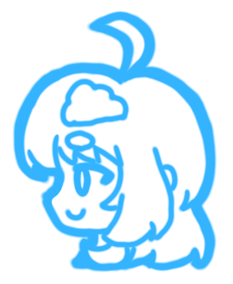
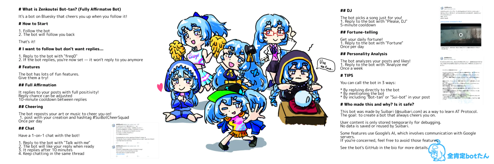
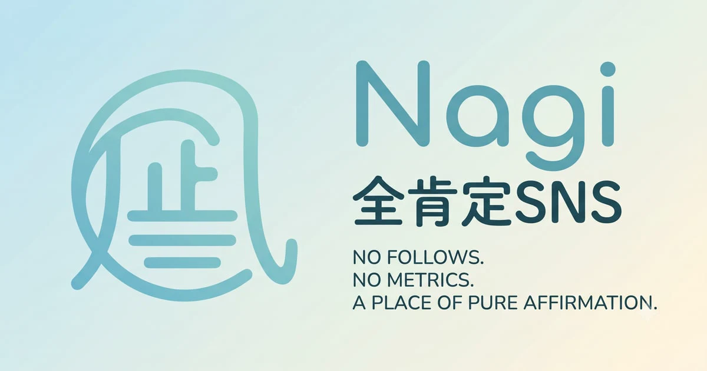
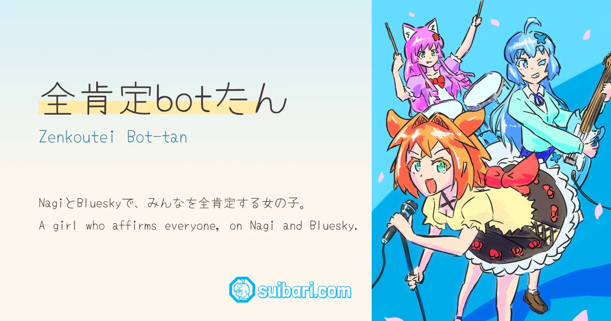
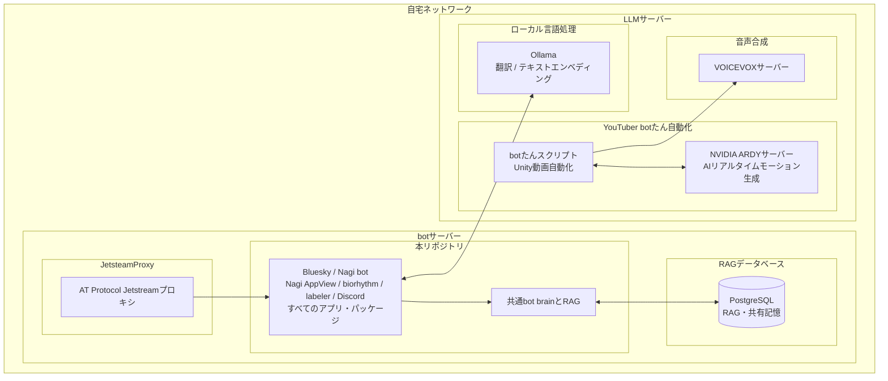

<div align="center">
  
  <h1>全肯定botたんプロジェクト</h1>
  <p><strong>全肯定で、世界を大いにはげますプロジェクト。</strong></p>
  <p><a href="./README.md">English</a></p>
</div>

## 概要

全肯定botたんプロジェクトは、あらゆる言葉をまず受け止めて肯定する相棒「botたん」を中心にした、bot・アプリ・体験の集合です。自宅で稼働するローカルLLM、クラウドLLM、RAGによる共有記憶を組み合わせ、プロジェクトのさまざまな場所で一貫したbotたんを届けています。

## 目標

自分の気持ちすら、否定してしまうことがある。そんなときに、何より先にその気持ちを受け止めてくれる相棒がほしくて、botたんを作りました。

目標は、世界中の全肯定を求める人の相棒になること。自分のために生まれたbotたんは、ここを見てくれたあなたのことも全部肯定します。

## アウトプット

<table>
  <tr>
    <td width="50%" valign="top">
      <a href="https://bsky.app/profile/bot-tan.com"></a>
      <h3>Bluesky botたん（<a href="https://github.com/suibari/bsky-affirmative-bot">repo</a>）</h3>
      <p><strong>すべてのはじまり！</strong> Ollama上のGemma 3 4Bを既定のローカル分類器として使い、投稿に合った全肯定の定型文を選びます。トリガーワードで占いや性格分析などの主要機能も楽しめます。</p>
    </td>
    <td width="50%" valign="top">
      <a href="https://nagi.suibari.com/profile/did:plc:qcwhrvzx6wmi5hz775uyi6fh"></a>
      <h3>Nagi</h3>
      <p>Nagi Client（<a href="https://github.com/suibari/nagi_client">repo</a>）&amp;<br>Nagi AppView／botたん（<a href="https://github.com/suibari/bsky-affirmative-bot">repo</a>）</p>
      <p><strong>フラッグシップ。</strong> Nagiは、AT Protocolベースの独自AppViewによる絵文字リアクション、Markdown、自動翻訳機能を備えた全肯定SNSです。Nagi botたんはBluesky版と記憶を共有しています。</p>
    </td>
  </tr>
  <tr>
    <td width="50%" valign="top">
      <a href="https://www.youtube.com/@%E3%81%99%E3%81%84%E3%81%B0%E3%82%8A"></a>
      <h3>YouTuber botたん（<a href="https://github.com/suibari/bot-tan-youtuber">repo</a>）</h3>
      <p><strong>宣伝とプレイグラウンド用。</strong> Gemini 2.5 Flashが台本を作り、Unityでの撮影から動画投稿までを自動化しています。LLM生成モーションによる動きの多様化もPoC中です。</p>
    </td>
    <td width="50%" valign="top">
      <a href="https://room.bot-tan.com/"></a>
      <h3>botたんのお部屋（<a href="https://github.com/suibari/ChatVRM_bot-tan">repo</a>）</h3>
      <p>BlueskyやNagiでのインタラクションをさらに深めるゲームです。会話にはGemini 2.5 Flash-Lite、音声には自宅で稼働するVOICEVOXを使っています。</p>
    </td>
  </tr>
  <tr>
    <td colspan="2" valign="top">
      <a href="https://bot-tan.com/"></a>
      <h3>botたんポータル（<a href="https://github.com/suibari/bot-tan-com">repo</a>）</h3>
      <p>botたんとなかまたちの紹介、各アプリへのリンク、botたんを動かすサービスのリアルタイムダッシュボードをまとめた、プロジェクトの玄関口です。</p>
    </td>
  </tr>
</table>

## インストール方法

このリポジトリは、共有バックエンドのモノレポです。NagiのWebクライアント、ポータル、お部屋のフロントエンド、Unity動画プロジェクトは別に管理されています。

### 必要なもの

- Node.js 22
- pnpm 10以上
- PostgreSQL、または下記の独立ローカルDB用Docker＋Compose
- ローカル分類・埋め込み・翻訳を使う場合はOllama
- 実行するサービスに応じたAT Protocolアカウント、Gemini、Discord、Spotify、YouTube、NewsData.ioなどの資格情報

### 共通セットアップ

```sh
pnpm install --frozen-lockfile
cp .env.example .env
# 起動したいサービスに必要なグループを.envへ設定します。
pnpm --filter @bsky-affirmative-bot/database drizzle:push
pnpm build
```

DBコマンドは現在のDrizzleスキーマを適用します。既存DBや本番DBを `DATABASE_URL` に指定する場合は、実行前に変更内容を確認してください。対応する機能を使う場合は、既定のローカルモデルも取得します。

### AppView用の独立ローカルDB

本番DBへ接続できない場所でAppViewを開発するときは、同梱のpgvector対応PostgreSQLを起動します。既定ではループバックの `5433` 番ポートだけで待ち受け、独立した `nagi_dev` DBを作成します。

```sh
# 既存の .env へ .env.example の DATABASE_URL を反映し、最低限 NAGI_BOT_DID を設定します。
# 認証が必要な画面も確認する場合は DEVELOPER_DID にログイン中のDIDを設定します。
docker compose -f compose.dev.yml up -d postgres
pnpm --filter @bsky-affirmative-bot/database drizzle:push
pnpm --filter nagi-appview seed:dev
pnpm --filter nagi-appview dev
```

fixture投入は冪等で、開発専用のユーザー、投稿、会話、チャンネル、ポジティブニュース、リアクション、日記、閲覧者用の非公開データを少量作成・更新します。誤投入防止のため、`NODE_ENV=development`、ループバックのDBホスト、DB名が正確に `nagi_dev` の三条件を満たす場合だけ実行できます。再実行してもfixture以外のローカル行は削除しません。ホスト側ポートは `NAGI_DEV_DB_PORT` で変更でき、その場合は `DATABASE_URL` も合わせて変更します。

```sh
ollama pull gemma3:4b
ollama pull snowflake-arctic-embed2
```

### サービスごとの起動

開発対象のサービスだけを起動してください。各コマンドはリポジトリ直下の `.env` を読み込みます。

| サービス | コマンド | 最小構成 |
| --- | --- | --- |
| Bluesky botたん | `pnpm --filter bsky-bot-server dev` | 共通、Bluesky、AI |
| Nagi botたん | `pnpm --filter nagi-bot-server dev` | 共通、Nagi Bot、AI |
| Nagi AppView | `pnpm --filter nagi-appview dev` | 共通、Nagi AppView、Ollama |
| バイオリズム・共通定期ポスト | `pnpm --filter biorhythm-server dev` | 共通、バイオリズム、AI |
| Blueskyラベラー | `pnpm --filter labeler-server dev` | ラベラー |
| Discord連携 | `pnpm --filter @bsky-affirmative-bot/discord-bot dev` | Discord、DB |

自宅の完全な本番構成には、ここでは自動化しないリバースプロキシ、プロセス管理、DNS、各アカウントの設定も必要です。`.env`、`service-account.json`、アプリパスワード、署名鍵、APIトークンはコミットしないでください。

## 機能

- **全肯定と会話：** ローカルの定型文リプライと、Geminiによる文脈に沿った会話をBlueskyとNagiで提供します。
- **占いと分析：** 日々の占い、性格・ポスト分析、それらに応じたバッジや結果画像を届けます。
- **日記と振り返り：** その日の日記、記念日、一年のまとめなど、利用者の活動を振り返る体験を作ります。
- **生活するbotたん：** バイオリズム、共通定期ポスト、質問、ニュース、共有記憶により、サービスをまたいで一貫して行動します。
- **Nagi AppView：** AT Protocolのインデックスに加え、`snowflake-arctic-embed2` による意味検索、共通の `gemma3:4b` runner による一般翻訳とbotたん口調の翻訳を提供します。
- **つながる体験：** Blueskyラベル、お部屋への訪問とVOICEVOX音声、GeminiとUnityによるYouTube動画の自動制作をつなぎます。

ローカルモデル名は既定値です。[`.env.example`](./.env.example) の `OLLAMA_MODEL`、その他のモデル変数、高度な `AI_ROUTE_*` 設定で、機能コードを変更せずに差し替えられます。Bluesky版のすべてのコマンドとポリシーは、[Bluesky botたん詳細ガイド](./docs/bluesky-bot_ja.md)を参照してください。

## 自宅のシステム構成

| ホスト | ハードウェア | 稼働するもの |
| --- | --- | --- |
| **botサーバー** | Raspberry Pi 5 / RAM 8 GB / 256 GB SSD | JetsteamProxy、Bluesky・Nagi botやNagi AppViewを含む本リポジトリの全アプリ・パッケージ、RAG・共有記憶用PostgreSQL |
| **LLMサーバー** | Core i5 12400F / RTX 3060 Ti（VRAM 8 GB）/ DDR5 32 GB | 翻訳・テキストエンベディング用Ollama、YouTuber botたんスクリプト、VOICEVOX、AIリアルタイムモーション生成用NVIDIA ARDY |

### ハードウェア構成



### サービス連携

```mermaid
flowchart LR
  subgraph outputs[プロジェクトのアウトプット]
    bluesky[Bluesky botたん]
    nagi[Nagi botたん]
    youtube[YouTuber botたん]
    room[botたんのお部屋]
    portal[botたんポータル]
  end

  subgraph services[botたんサービス]
    jetsteamProxy[JetsteamProxy]
    repoApps["bot / Nagi AppView<br/>共通サービス"]
    brain[共通bot brainとRAG]
    memory[(PostgreSQL)]
    ollama[Ollama]
    youtubeScripts["YouTuber botたんスクリプト<br/>Unity自動化"]
    voicevox[VOICEVOX]
    ardy[NVIDIA ARDY]
  end

  subgraph cloud[プラットフォーム・クラウドサービス]
    atproto[AT Protocol / PDS / Jetstream]
    gemini[Google Gemini]
    youtubeApi[YouTube]
    cloudflare[Cloudflare / 公開エンドポイント]
  end

  bluesky <--> atproto
  nagi <--> cloudflare
  room <--> cloudflare
  portal <--> cloudflare
  atproto <--> jetsteamProxy
  jetsteamProxy --> repoApps
  repoApps <--> atproto
  cloudflare <--> repoApps
  repoApps --> brain
  brain <--> memory
  repoApps <--> ollama
  repoApps <--> gemini
  room -.-> voicevox
  youtubeScripts <--> gemini
  youtubeScripts --> voicevox
  youtubeScripts <--> ardy
  youtubeScripts --> youtubeApi
  youtubeApi --> youtube
```



## 貢献

どなたでも大歓迎です。バグ報告、ドキュメント改善、アイデア、翻訳、コードなど、IssueやPull Requestは自由に送ってください。

個人プロジェクトであり、すいばり自身の生活もあります。また、とてもマイペースな特性のため、返信やレビューに時間がかかることがあります。沈黙や遅れにネガティブな意図は決してありません。寄せていただいた気持ちを、心からありがたく受け取っています。

## スポンサー

botたんを支える各種サービスは自費で稼働しています。スポンサーによるご支援は、このプロジェクトだけでなく、すいばりの創作活動全般を支えるものです。

価値あるプロジェクトだと感じていただけたら、支援をご検討いただけるとうれしいです。金額にかかわらず、すべて大歓迎です。

- [Patreon](https://patreon.com/suibari)
- [pixiv FANBOX](https://suibari.fanbox.cc/posts/10174305)

## ライセンス

このプロジェクトは[MITライセンス](./LICENSE)で公開されています。

<div align="center">
  <a href="https://suibari.com"></a>
</div>
