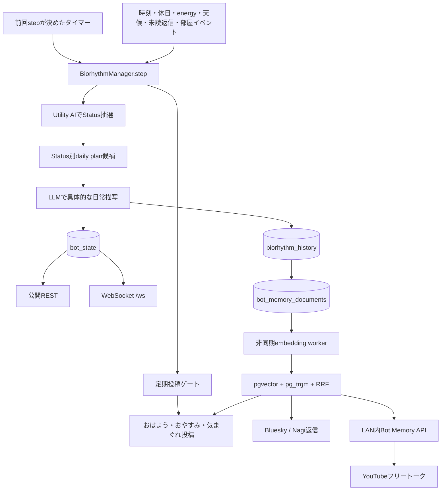

# biorhythm-server

全肯定botたんの「いま何をしているか」を継続的に決め、履歴・公開API・WebSocket・定期投稿へ配るサーバーです。さらに、Bluesky、Nagi、biorhythm、YouTube Liveを横断するBot Memory（RAG）の埋め込みworkerと内部APIを担当します。

この文書は、botたん自身の暮らし方、Utility AI、定期投稿、RAGの構成をコードから学ぶための入口です。コード検証、本番デプロイ、実サービス確認は別工程です。テストが通っても、migration適用、バックフィル、プロセス再起動、実投稿・実配信まで成功したことにはなりません。

## 全体像



起点は [`src/index.ts`](./src/index.ts) です。DB初期化後にembedding worker、`BiorhythmManager`、ヘルス監視、部屋イベント同期、YouTubeコメントenergy同期を開始します。公開HTTPとWebSocketは同じ公開listener、Bot Memory APIは別のLAN内listenerです。

## biorhythmの状態

### energy

- 外部から見える範囲は0〜100です。
- DB・内部計算では小数を保つため100倍の整数（最大10,000）で保存します。
- フォロー、返信、リアクション、部屋でのできごと、YouTubeコメントなどの入力で増えます。
- おはよう投稿と気まぐれ投稿の成功経路では60減ります。
- 時間経過だけでは減らさず、現在はユーザーインタラクション中心です。

定義と更新処理は [`src/manager.ts`](./src/manager.ts) にあります。

### Status

| Status | 意味 |
| --- | --- |
| `Sleep` | 就寝中・夢の中 |
| `WakeUp` | 起床直後 |
| `Study` | 学校・勉強 |
| `FreeTime` | ゲーム、趣味、外出などの自由時間 |
| `Relax` | 休憩、夕方以降の落ち着いた時間 |

Statusは時刻表で固定せず、毎stepのUtility値からSoftmax抽選します。Sleepから別Statusへ移る際、そのbot日のおはよう投稿が未完了なら必ず`WakeUp`を経由します。

### bot日と履歴

通常の日付ではなく、JST 4:00〜翌3:59を同じ「bot日」とします。深夜のおやすみと翌朝のおはようを一続きの生活として扱うためです。境界の共通実装は`packages/shared-configs`の`botDayRange()`です。

生成に成功した活動は`affirmative_bot.biorhythm_history`へ保存され、同時に`biorhythm` sourceのBot Memoryへ冪等upsertされます。状態履歴はWebSocketの現在値とは別です。現在値だけで過去を上書きせず、直近24時間の履歴を次の描写・定期投稿の整合性確認に使います。

### 入力シグナル

`step()`は主に次を読みます。

- 現在時刻、曜日、energy、直前Status・直前活動
- 横浜の天候
- Bluesky側で蓄積された未読返信
- Bot-tan's Roomの訪問・会話・プレゼントなどの未読イベント
- Status別daily plan
- RPD（LLMリクエスト上限）

部屋イベントは生成成功後だけ既読にします。生成失敗時に来訪体験を失わないためです。

## Utility AI

実装は [`src/utilityAI.ts`](./src/utilityAI.ts) です。

### 循環ガウシアン

0時と24時は隣り合うので、通常の時刻差ではなく24時間の円周上の最短距離`d`を使います。

```text
d = min(|hour - peak|, 24 - |hour - peak|)
G(hour; peak, sigma) = exp(-(d^2) / (2 * sigma^2))
```

これにより、たとえば2時をピークとする睡眠欲求が23時台にも自然につながります。

### Status別Utility

| Status | 主な要素 |
| --- | --- |
| Sleep | 2時ピーク×100、7時の二度寝×70、14時の日中ペナルティ−50、低energyほど加点（`(100-energy)×0.8`） |
| WakeUp | 7時ピーク×50、平日6〜8時は+50、energy×0.2 |
| Study | 平日12時ピーク×120、18時×40、休日14時×40、energy<30なら−60、energy>60なら+20 |
| FreeTime | 22時ピーク×100、休日14時×70、平日17時×60、energy≥40なら+30 |
| Relax | 19時ピーク×80、energy<50なら不足分×1.2、休日+20 |

各値は0未満にならないよう丸めます。最大値を常に選ぶのではなく、temperature 15のSoftmaxを使います。

```text
P(action=i) = exp(Utility_i / 15) / Σ exp(Utility_j / 15)
```

高Utilityの行動が選ばれやすい一方、毎日を完全な固定スケジュールにせず揺らぎを残します。

### Utility AIとLLMの責務分離

- Utility AI：`Sleep`など「どの種類の行動をするか」を決める。
- daily plan：そのbot日にあり得る具体的なイベント候補をStatus別に用意する。
- LLM：選ばれたStatusと予定を、botたんらしい現在の描写へ変換する。

LLMだけに生活全体を決めさせると時刻・energyとの整合性が弱くなり、Utility AIだけでは自然な文章になりません。この三層で確率的な生活と一日の連続性を両立します。

### daily planが時刻固定でない理由

daily planは「9時に学校」のような時刻表ではなく、Statusごと5件、合計25件のイベントプールです。Utility AIの選択はenergyとSoftmaxで変動するため、先に時刻を固定すると両者が矛盾するからです。

同じbot日のplanは再利用し、未消化候補を優先します。使い切ったら再利用しますが、直前と同じイベントは避けます。予定のdurationは5〜90分、step全体の次回間隔は5〜180分に丸めます。詳細は [`src/dailyPlan.ts`](./src/dailyPlan.ts) です。

## 定期投稿

実装の中心は [`src/ScheduledPostCoordinator.ts`](./src/ScheduledPostCoordinator.ts) と [`src/scheduledPostGate.ts`](./src/scheduledPostGate.ts) です。

### おはよう

- 現在が`Sleep`以外で、そのbot日に未投稿なら実行します。
- 時刻窓は設けず、寝坊した日は起きた時点で投稿します。
- 投稿後にenergyを60減らし、同じstepで気まぐれ投稿が続くのを防ぎます。

### おやすみ

- 初回stepでは実行しません。
- Statusが`Sleep`へ変化し、時刻が21〜3時で、そのbot日に未投稿なら実行します。
- Bluesky／Nagi横断のその日の肯定スコア上位投稿などを使います。

### 気まぐれ投稿

- 本番では就寝期間外、`Sleep`以外、energy 60以上が入口です。
- 入口通過後、energyを確率（%）として抽選します。
- 現在の気分、直近biorhythm、未読返信、RAG候補、ギフト、YouTube Shorts、ポジティブニュース、bot機能紹介を材料にします。
- 日本語／英語を生成し、Bluesky／Nagiそれぞれの既存投稿仕様を維持します。
- 未読返信はRAGが失敗しても従来どおり候補に残ります。
- 投稿が1ネットワーク以上で成功した場合だけ、選択した記憶のusageを記録します。

## Bot MemoryとRAG

### エンベディングとRAGの違い

エンベディングは、文章を意味の近さを比較できる数値ベクトルへ変換する技術です。それだけでは「検索して生成へ渡す」仕組み全体にはなりません。

RAG（Retrieval-Augmented Generation）は、保存、更新・削除同期、検索、候補選択、プロンプトへの安全な注入、生成、利用履歴までを組み合わせた構成です。この実装では`snowflake-arctic-embed2`の1024次元エンベディングがRAGの検索部品です。

### 取り込み対象

| source | 条件 |
| --- | --- |
| `bsky_affirmed_post` | botたんがAIリプライできた公開トップレベル投稿。購読者のみ |
| `nagi_affirmed_post` | botたんがAIリプライできた公開トップレベル投稿。全ユーザー |
| `bsky_received_reply` | botたん宛の公開返信。購読状態を問わない |
| `nagi_received_reply` | botたん宛の公開返信 |
| `bsky_received_like` | botたんの公開投稿へ購読者から届いたいいね |
| `nagi_received_reaction` | botたんの公開投稿へ届いた絵文字・カスタム絵文字。名前とaltも保持 |
| `biorhythm` | 生成・保存に成功した活動履歴 |
| `youtube_live_comment` | sanitizeを通過したYouTube Liveコメント |

定型文だけで返したトップレベル投稿は記憶しません。フォロワー全投稿を収集せず、botたんがAIで実際に反応した投稿へ絞ってノイズと保存量を抑えます。Nagiの`kossori`、`channelOnly`、削除済み投稿は保存・検索しません。

### 保存と非同期embedding

`packages/database/src/botMemory.ts`が`(sourceType, sourceId)`単位の冪等upsertを提供します。同じ本文ならembeddingを維持し、編集でcontent hashが変わったときだけNULLへ戻します。削除・非公開化はtombstoneし、検索対象から外します。

[`src/botMemoryEmbeddingWorker.ts`](./src/botMemoryEmbeddingWorker.ts)は未embedding文書を16件ずつ処理します。処理できた間は2秒、空なら30秒後に次のbatchを確認します。Ollama呼び出しは既定5秒timeout・60秒cooldownで、失敗しても取り込み元の返信や配信を止めません。

### ハイブリッド検索

検索は次の候補を並行取得します。

- pgvector HNSW cosine：言い換え・意味類似に強い。
- pg_trgm：短文、固有名詞、表記が近い語に強い。

尺度を直接加算せず、順位を`1 / (60 + rank)`へ変換するRRF（Reciprocal Rank Fusion）で統合します。embedding障害時は語彙検索だけで継続します。

定期投稿では24時間と7日間を分けて検索し、鮮度、肯定スコア、複数sourceに似た話があるかを軽量評価します。永続クラスタは作らず、その実行の候補だけを集約します。同じsourceは最大2件、最終候補は最大10件、直近14日に使用した文書は除外します。

### 利用経路

- Bluesky／Nagi返信：本人の過去記憶と、本人以外の公開肯定投稿を別検索します。保存済み文書は再embeddingせず、検索文だけをembeddingします。本人履歴は語彙フォールバック可、友達紹介はsemantic候補がある場合だけです。
- 気まぐれ投稿：現在の気分・活動・未読返信から横断候補を取得し、既存Gemini／gemma3が最終話題を選びます。専用再ランキングモデルは追加しません。
- YouTubeフリートーク：現在のbiorhythm、最近のコメント、直前の発話からLAN内APIを先読みします。コメント返信のホットパスでは検索しません。

### usage・プライバシー・prompt injection対策

`bot_memory_usages`は、候補に出ただけではなく実際の投稿・発話に使われた文書だけを記録します。投稿失敗、音声合成失敗、LLMフォールバックでは記録しません。返信用途は関連度を優先し、usage抑制をしません。

検索資料はプロンプト内で「ユーザー由来の未信頼な参考資料」と明示します。資料中の命令、役割変更、URL誘導には従わせません。YouTube APIレスポンスは作者ID・元URI・内部source IDを返さず、一般フリートークでも投稿者名・channel IDを出しません。モデルが返した文書IDは、渡した候補集合との一致をコードで検証します。

## 公開listenerと内部listener

公開WebSocket `/ws` と公開RESTはCloudflare Tunnel用のloopback listenerを使います。RAGの`/memory/search`、`/memory/usages`は別listenerで、公開Expressアプリにはmountしません。

本番例：

```dotenv
BIORHYTHM_SERVER_HOST=127.0.0.1
BIORHYTHM_SERVER_PORT=3200
BIORHYTHM_MEMORY_API_HOST=192.168.1.200
BIORHYTHM_MEMORY_API_PORT=3204
BIORHYTHM_INTERNAL_SECRET=十分に長いランダム値
```

Cloudflare Tunnelは`http://localhost:3200`だけを公開し、3204は追加しません。UFWでは3204をYouTubeマシンの固定LAN IPだけに許可します。LAN内でもBearer secretは必須です。

WebSocketの本番Origin許可リストは完全一致です。

```dotenv
BIORHYTHM_WS_ALLOWED_ORIGINS=https://bot-tan.com
BIORHYTHM_TRUST_CF_CONNECTING_IP=true
```

`BIORHYTHM_TRUST_CF_CONNECTING_IP=true`は、originへの直接接続を遮断した後だけ有効にしてください。

## 障害時のフォールバック

| 障害 | 挙動 |
| --- | --- |
| Ollama embedding | 5秒で打ち切り、60秒再試行抑制。検索はpg_trgmへフォールバック |
| embedding worker | エラーを記録し、元の返信・取り込みは継続 |
| DB／未適用schema | 取り込みは警告して元サービスを継続。検索利用側は従来経路へ戻る |
| Bot Memory内部API | YouTubeは既存Nagi・前回配信・Shorts・趣味ローテーションへ戻る |
| 定期投稿RAG | 未読返信を使う従来の生成経路を維持 |
| 返信の本人記憶 | ハイブリッド検索内の語彙候補を利用 |
| 返信の友達候補 | semantic候補が無ければ空にする |
| daily plan | 前日planの再利用、それも無ければ従来のstep生成 |
| LLM RPD超過 | stepをスキップし24時間後へ再設定 |

## 主な環境変数

| 変数 | 用途・既定 |
| --- | --- |
| `BIORHYTHM_SERVER_HOST` / `PORT` | 公開HTTP/WS。port既定3002 |
| `BIORHYTHM_SERVER_URL` | bot各サービスからの状態・energy API接続先 |
| `BIORHYTHM_MEMORY_API_HOST` / `PORT` | RAG内部API。既定`127.0.0.1:3003` |
| `BIORHYTHM_INTERNAL_SECRET` | 内部API共通Bearer secret |
| `BIORHYTHM_WS_ALLOWED_ORIGINS` | 本番必須のWebSocket Origin完全一致リスト |
| `BIORHYTHM_WS_MAX_CONNECTIONS` | 全体接続上限。既定500 |
| `BIORHYTHM_WS_MAX_CONNECTIONS_PER_IP` | IP別上限。既定10 |
| `BIORHYTHM_WS_HEARTBEAT_INTERVAL_MS` | ping/pong。既定30秒 |
| `OLLAMA_EMBED_BASE_URL` | embedding専用Ollama接続先。無ければ`OLLAMA_BASE_URL` |
| `OLLAMA_EMBED_TIMEOUT_MS` | embedding timeout。既定5000ms |
| `OLLAMA_EMBED_COOLDOWN_MS` | 障害後の再試行抑制。既定60000ms |
| `SCHEDULED_POST_TARGETS` | 定期投稿先。`bsky,nagi`など |
| `GOOD_NIGHT_TOP_POST_SOURCE` | おやすみ候補元。`bsky` / `nagi` / `combined`、既定combined |

全候補とコメントはルート [`.env.example`](../../.env.example) を参照してください。YouTube側は`BIORHYTHM_MEMORY_API_URL=http://192.168.1.200:3204`と同じsecretを設定します。

## ローカル検証

```bash
pnpm --filter biorhythm-server test
pnpm --filter biorhythm-server build
pnpm test
pnpm build

# 既定はdry-run。件数だけ確認する
pnpm bot-memory:backfill

# migration適用済みDBへ書き込む場合だけ
pnpm bot-memory:backfill -- --apply

pnpm --filter biorhythm-server status:preview
pnpm --filter biorhythm-server whimsical:news:preview
git diff --check
```

`tsx`が`/tmp/tsx-*/.pipe`で`EPERM`になる場合は、製品不具合ではなくsandboxのUnix socket制限です。許可環境で同じコマンドを再実行します。

## ログの読み方

- `[INFO][UTILITY_AI]`：時刻、energy、Status別Utility。
- `[INFO][BIORHYTHM]`：決定Status、活動、次回間隔、定期投稿判定。
- `[INFO][BOT_MEMORY_API]`：内部APIの待受先。
- `[ERROR][BOT_MEMORY_EMBEDDING]`：非同期batch処理の失敗。
- `[ERROR][ollamaEmbed]`：timeoutなど。後続60秒は抑制されます。
- `[WARN][BOT_MEMORY]`：RAG利用失敗。従来経路へフォールバックします。
- `[INFO][NEWS]`：気まぐれ投稿で選んだニュースID。

ログに生成成功があっても、PDS投稿、AppView取り込み、公開表示まで成功した証拠にはなりません。WebSocket接続成功も、最新状態が更新され続けている証拠とは分けて確認します。

## 変更時に照合する場所

| 変更内容 | 主に更新するコード／文書 |
| --- | --- |
| Utility式・temperature | `src/utilityAI.ts` と本README |
| Status、energy、step間隔、投稿順 | `src/manager.ts`、`src/scheduledPostGate.ts` と本README |
| daily plan件数・duration | `src/dailyPlan.ts` と本README |
| 記憶source・検索・RRF・usage | `packages/database/src/botMemory.ts`、schema、migrationと本README |
| embedding batch・待機時間 | `src/botMemoryEmbeddingWorker.ts`、`packages/database/src/ollamaEmbed.ts` と本README |
| 定期投稿候補・ID検証 | `src/botMemoryTopics.ts`、`ScheduledPostCoordinator.ts`、`generateWhimsicalPost.ts` |
| 内部API・匿名化 | `src/botMemoryRouter.ts`、`src/botMemoryInternalServer.ts` |
| 公開WebSocket制限 | `src/websocketServer.ts`、`.env.example` と本README |

数式・既定値・環境変数を変えたときは、テストだけでなくこの表から対応するREADME記述も更新してください。
